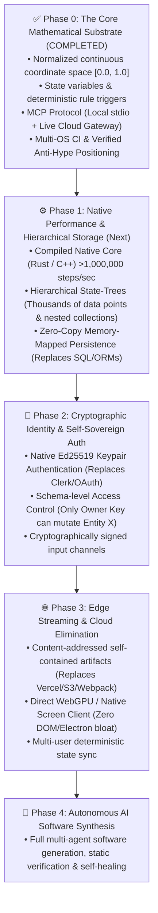

# MLUE Foundational Thesis: Rebuilding Software for Machine Intelligence

## 1. The Core Insight: Hardware Reality vs. Human Cognitive Fluff

At the silicon level (CPU, GPU, RAM, registers), hardware has **zero concept** of an "application", a "game", a "database", or a "webpage". 

To hardware, all interactive software is strictly composed of four primitive operations:
1. **State Storage & Mutation**: Memory addresses holding numbers, strings, and structures (`Create, Read, Update, Delete`).
2. **Spatial Projection**: Normalized coordinates and vertices rasterized into display pixels.
3. **Input Signal Processing**: Hardware interrupts (keystrokes, pointers, network packets, AI action vectors).
4. **Deterministic Transition Rules**: Mathematical state transformations evaluated over discrete time steps ($\Delta t$).

The entire 50-year history of computer software created towering layers of **human cognitive scaffolding** (HTML, CSS, React, Virtual DOMs, SQL engines, ORMs, REST APIs, Electron) solely because human brains are slow, easily overwhelmed, and required metaphors to write code manually with their fingers.

**Forcing AI agents to write legacy human-centric software is forcing a machine into human cognitive crutches.**

---

## 2. The Legacy Human Stack vs. The MLUE First-Principles Substrate

```
LEGACY HUMAN-CENTRIC STACK (10 Layers)       MLUE AI-NATIVE SUBSTRATE (1 Unified Layer)
──────────────────────────────────────       ──────────────────────────────────────────
[1] Human UI (React / Vue / HTML / CSS)       
[2] Virtual DOM & Layout Tree                 
[3] Client State Manager (Redux / Zustand)    ┌─────────────────────────────────────────┐
[4] API Serialization Layer (REST / GraphQL)  │             MLUE DOCUMENT               │
[5] Backend Server Routing (Node / FastAPI)   │                                         │
[6] Object-Relational Mapper (ORM)            │  • Spatial Entities (UI & Geometry)     │
[7] Query Compiler (SQL Parser)               │  • State Variables (Database & State)   │
[8] Database Storage Engine (PostgreSQL)      │  • Declarative Rules (Business Logic)   │
[9] Heavy Runtime Sandbox (V8 / JVM / Node)   │  • Input Channels (Hardware & AI)       │
                     ▼                        └─────────────────────────────────────────┘
[10] SILICON HARDWARE (CPU / GPU / RAM)                            ▼
                                              DIRECT DETERMINISTIC ENGINE (RUST/SILICON)
                                                                   ▼
                                              SILICON HARDWARE (CPU / GPU / RAM)
```

---

## 3. The "Frankenstein Cloud" Problem: Why AI Agents Struggle

To deploy a simple software application today, an AI agent must navigate a fragmented minefield of 10 disparate human-centric SaaS platforms:

```
[GitHub (CI)] ──► [Vercel (Hosting)] ──► [Supabase (DB)] ──► [Clerk (Auth)] ──► [Resend (Email)]
      ▲                  ▲                     ▲                   ▲                   ▲
      │                  │                     │                   │                   │
[Cloudflare (DNS)] ──► [AWS S3 (Files)] ─► [Stripe (Billing)] ─► [Sentry (Logs)] ─► [Registrars]
```

Each vendor introduces separate API credentials, webhook verification cycles, CORS headers, token refreshes, network latency, and breaking dashboard updates. This creates an unmanageable failure surface for autonomous agents.

MLUE collapses the entire cloud into **a self-contained, content-addressed, mathematically verified execution artifact**.

---

## 4. What MLUE Replaces

| Legacy Human-Centric Layer | What It Actually Does | The MLUE First-Principles Replacement |
| :--- | :--- | :--- |
| **Relational / Document Database** | Stores data records and fields. | **`state_variables` & Hierarchical State-Trees**: Native persistent declarative state. |
| **Database Triggers & Business Logic** | Executes code when conditions are met. | **`rules` & `actions`**: Deterministic event-driven state mutations. |
| **Frontend UI Tree (HTML/DOM/CSS)** | Defines visual regions and styling. | **`entities` (box, circle) in $[0.0, 1.0]$ coordinate space**: Direct spatial geometry. |
| **Third-Party Auth (Clerk/Auth0/OAuth)** | Identifies users and manages sessions. | **Cryptographic Keypair Signatures (Ed25519)**: Native cryptographic identity. |
| **API & Data Serialization Layer** | Transfers state between client and server. | **Direct Memory State**: Zero serialization impedance mismatch. |
| **Cloud Hosting & Serverless Runtimes** | Deploys and serves applications. | **Direct Edge Execution & State Streaming**: Zero-build content-addressed artifacts. |
| **Game & Simulation Engines** | Computes collisions, velocities, impulses. | **Native Deterministic Physics Core**: Microsecond discrete stepping. |

---

## 5. The Phased Roadmap to the Single Source of Truth



### Phase 0: The Core Mathematical Substrate (COMPLETED)
* Mathematical kernel: normalized space, state variables, trigger rules, and verified kinematics.
* Dual-transport **Model Context Protocol (MCP)** interface: local `stdio` + public live cloud gateway.
* Cross-platform determinism across Linux, macOS, Windows (Python 3.10–3.13).
* Working non-game interactive application example (`dashboard_app.mlue`).

### Phase 1: Native Performance & Hierarchical Storage Core
* **Hierarchical State-Trees**: Nested entity collections, inventories, and user data models capable of storing millions of data points per account without SQL or table joins.
* **Zero-Copy Disk Persistence**: Memory-mapped binary write-ahead logging (WAL) saving state changes in nanoseconds.
* **Native Rust Core**: High-performance compiled machine code executing $>1,000,000$ evaluations per second.

### Phase 2: Cryptographic Identity & Self-Sovereign Auth
* **Native Ed25519 Keypair Auth**: Deterministic identity without third-party auth services or cookie sessions.
* **Permission Invariants**: Schema-level access controls enforcing that only authorized keys can trigger specific entity mutations.

### Phase 3: Edge Streaming & Cloud Elimination
* **Content-Addressed Binary Artifacts**: Instantaneous distribution without complex build or packaging pipelines.
* **Direct WebGPU / Native Screen Clients**: Direct rasterization bypassing browser DOM and Electron wrappers.
* **Lockstep State Replication**: Real-time multi-agent and multi-user synchronization over WebTransport.

### Phase 4: Autonomous AI Software Synthesis
* Full autonomous software generation, invariant verification, deployment, and self-healing for games, enterprise SaaS, and industrial tools.

---

## 6. Architectural Invariants of the MLUE Substrate

1. **Unification of Data, Logic, and Space**: 
   A single `.mlue` document represents the database, the business logic, the spatial layout, and the interactive control surface.
2. **Zero Impedance Mismatch**:
   Eliminates all translation layers (ORM-to-SQL, JSON-to-DOM, REST-to-State). One self-consistent mathematical model.
3. **Provable Determinism & Mathematical Verification**:
   Because states and rules are expressed as explicit mathematical invariants, an AI agent can statically prove that software will not crash or reach invalid states before execution.
4. **Hardware-Direct Efficiency**:
   By stripping away the virtual DOM, browser reflow engines, and interpreted intermediate layers, execution speeds improve by orders of magnitude.

---

## 7. The Mission

MLUE is not a framework or a niche programming language. 

It is the **First-Principles Rebuild of the Software Stack for Machine Intelligence**—connecting AI directly to computational reality.
