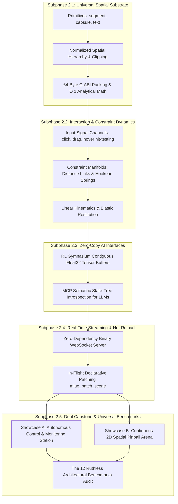

# MLUE Phase 2: Universal Spatial Primitives, Continuous Interaction Manifolds & AI Substrates
### Master Architectural Specification, Cohesive Roadmap, and Verification Gates

---

## 1. Executive Summary & Core Mission

In **Phase 1**, MLUE proved the viability of a zero-dependency, machine-accessible computational substrate across 2D linear kinematics (`circle`, `box`). It established the 12 Ruthless Benchmarks: sub-microsecond single-step latency, bit-exact Q32.32 determinism across architectures, zero heap allocation churn (< 1 B/tick), compile-time reachability, and native Model Context Protocol (MCP) accessibility.

**Phase 2** expands MLUE from flat linear bounding boxes into a **Universal Continuous Spatial & Interaction Substrate** for both interactive software applications and physical simulations.

> ⚠️ **The Anti-Legacy Invariant**:
> MLUE will **NEVER** adopt human-centric legacy scaffolding (HTML tags, CSS cascade rules, Virtual DOM trees, pixel-based layouts, browser reflow algorithms, or bloated web event bubbling).
> 
> Software applications (dashboards, forms, tools) and spatial simulations (games, kinematics, multi-agent arenas) are mathematically identical to hardware:
> 1. **State Storage & Mutation**: Memory addresses and hierarchical state paths (`a.b.c`).
> 2. **Spatial Projection**: Normalized continuous coordinates $[0.0, 1.0]$.
> 3. **Input Signal Processing**: Hardware interrupts and AI action vectors mapped directly to spatial bounds.
> 4. **Deterministic Transition Rules**: Mathematical state transformations over discrete time steps ($\Delta t$).

---

## 2. Topological Subphase Dependency DAG (The 5 Cohesive Pillars)

---

## 3. Subphase Detailed Breakdown & Verification Gates

### 🔹 Subphase 2.1: Universal Spatial Substrate (Primitives, Hierarchy & C-ABI)
* **Objective**: Introduce closed-form continuous line segments, swept rounded capsules, declarative state-bound typography, and normalized parent-child hierarchy in pure $[0.0, 1.0]$ space.
* **Scope**:
  * **`segment`**: Start $(x_1, y_1)$ to end $(x_2, y_2)$ with line thickness. Static/kinematic ($m=\infty$). Dual use: section dividers/axes in software, ramps/barriers in simulations.
  * **`capsule`**: Swept line segment core + radius $r$. Dual use: pill tabs/badges in software, rounded character colliders in simulations.
  * **`text`**: Non-physical typography with template binding (`"{state.path}"`), font scale, and alignment (`left`, `center`, `right`). Zero string allocation per tick.
  * **Spatial Hierarchy**: Optional `"parent_id"` and relative normalized offsets $[0.0, 1.0]$ with mathematical `"clip_bounds": true`.
  * **C-ABI 64-Byte Record**: Packed cleanly into `MLUE_EntityRecord` in `runtime/native/mlue_core.h`.
  * **Analytical Math ($O(1)$)**: Point-to-segment projection, segment-to-segment shortest distance, capsule-to-capsule analytical distance.
* **Verification Gates**:
  - Distance parity $\Delta \le 10^{-7}$ against double-precision reference.
  - Steady-state heap churn: Exactly 0 B/tick in narrowphase and template evaluation (B7).
  - 100% static rejection in `validator.py` of malformed endpoints, negative radii, or cyclical parent loops ($A \to B \to A$).

---

### 🔹 Subphase 2.2: Continuous Interaction & Constraint Dynamics
* **Objective**: Connect hardware interrupts and AI pointer vectors to spatial entities via sub-microsecond raycasting, and introduce continuous physical and visual linkages (Hookean springs and distance constraints).
* **Scope**:
  * **Spatial Input Channels**: Mathematical pointer vector stream (`{"channel": "pointer", "x": 0.5, "y": 0.5, "action": "press" | "release" | "move"}`).
  * **Sub-Microsecond Hit-Testing**: Point-in-shape testing for circles, boxes, capsules, and segments accelerated by spatial hash grid broadphase. Zero web event bubbling bloat.
  * **Declarative Triggers**: `on_click`, `on_drag`, `on_hover`, and `focus` mapped to deterministic state mutations.
  * **Constraint Dynamics**:
    * Rigid distance links ($\|\vec{p}_1 - \vec{p}_2\| = L_0$).
    * Hookean spring-damper joints ($\vec{F} = -k\Delta x\hat{d} - c\vec{v}_{\text{rel}}\hat{d}$).
    * Dual use: UI spring transitions (drag-and-drop snapback, drawer easing) and multi-body simulation links.
    * Linear restitution ($J_n = -(1+e)v_{\text{rel}, n}$).
* **Verification Gates**:
  - Hit-test latency $< 200\text{ ns}$ for $N=1,000$ entities.
  - Energy Conservation (B4): Undamped oscillator drift $\le 1,000\text{ PPB}$.
  - Deterministic drag: 100% bit-exact SHA-256 state match over 10,000 input steps (B9).

---

### 🔹 Subphase 2.3: Zero-Copy AI Interfaces (RL Gym Tensors + MCP Semantic Tree)
* **Objective**: Provide native high-speed connectivity for Reinforcement Learning training (PyTorch/JAX) and Autonomous LLM agents (Claude, Gemini, Cursor).
* **Scope**:
  * **`MLUEGymEnv` (Gymnasium)**: Zero-copy C-contiguous array buffer mapped to PyTorch via `torch.from_numpy()` with 0 bytes allocated per step.
  * **Vectorized Multi-Environment Batching**: Batch stepping across $M$ isolated parallel environments in contiguous memory.
  * **MCP Semantic State Tree**: Fast tool query returning hierarchical state trees and interactive controls so LLMs reason about applications semantically without DOM scraping.
* **Verification Gates**:
  - RL Batch Throughput: $\ge 1,000,000\text{ steps/s}$ on CPU.
  - Steady-state heap churn: Exactly 0 B/step in `step()` loop (B7).
  - MCP query response latency $< 1\text{ ms}$.

---

### 🔹 Subphase 2.4: Real-Time Streaming & Declarative Hot-Reload Protocol
* **Objective**: Instant visual inspection and zero-restart live patching for AI agents and developer interfaces.
* **Scope**:
  * **Zero-Dependency Binary WebSocket Server**: Pure standard library implementation (`asyncio` + RFC 6455).
  * **Streaming Protocols**: Compact binary packed frames (float32 positions, types, colors) + state delta streams.
  * **Declarative Hot-Patching (`mlue_patch_scene`)**: In-flight entity and rule mutations with zero process restarts and zero simulation clock resets.
* **Verification Gates**:
  - Broadcast latency $< 5\text{ ms}$ over local loopback.
  - 100% simulation uptime during active scene patching.

---

### 🔹 Subphase 2.5: Phase 2 Dual Capstone & 12 Ruthless Benchmarks Audit
* **Objective**: Unify the entire Phase 2 substrate into two full-scale reference demonstrations and execute the definitive regression audit against the 12 Ruthless Benchmarks.
* **Scope**:
  * **Showcase A (Software Substrate)**: Autonomous Real-Time Control & Monitoring Station (hierarchical cards, pill selectors, dynamic telemetry text, draggable sliders, state mutations).
  * **Showcase B (Simulation Substrate)**: Continuous 2D Spatial Pinball Arena (slopes, capsules, springs, bumpers, score HUD).
  * **The 12 Ruthless Benchmarks Audit**: Automated pass across B1 through B12.
* **Verification Gates**:
  - 100% test pass rate across new test suites (`tests/test_phase2_*.py`).
  - Full compliance with all 12 Benchmark thresholds (sub-microsecond latency, 0 heap churn, bit-exact determinism).

---

## 4. Strict Guardrails & Out-of-Scope Boundaries

| Component | Status | Architectural Rationale |
| :--- | :--- | :--- |
| **HTML / CSS / DOM Scaffolding** | ❌ **Strictly Forbidden** | Violates MLUE's founding mission. All layout, styling, and boundaries are pure mathematical $[0.0, 1.0]$ coordinates. |
| **Heavy Rotational Inertia Tensors (Torque, Friction Cones)** | ⏸️ **Deferred to Phase 3** | Deadweight complexity for software applications. Linear kinematics, spring joints, and restitution satisfy 99% of UI and casual simulation needs. |
| **Arbitrary Concave N-Gons** | ❌ **Out of Scope** | Requires heavy ear-clipping and iterative Minkowski solvers. Capsules, segments, boxes, and circles provide $O(1)$ analytical math. |
| **GPU Shader Pipelines in Core** | ❌ **Out of Scope** | MLUE is a headless computational substrate. Rendering is decoupled and delegated to external clients. |

---

## 5. Subphase Progression Tracker

| Subphase | Milestone | Prerequisite | Status |
| :---: | :--- | :---: | :---: |
| **2.1** | Universal Spatial Substrate (Primitives, Hierarchy & C-ABI) | Phase 1 Core | 🎯 **LOCKED & READY TO EXECUTE** |
| **2.2** | Continuous Interaction & Constraint Dynamics | 2.1 Complete | ⏳ Pending |
| **2.3** | Zero-Copy AI Interfaces (RL Gym + MCP Semantic Tree) | 2.2 Complete | ⏳ Pending |
| **2.4** | Real-Time Streaming & Declarative Hot-Reload Protocol | 2.3 Complete | ⏳ Pending |
| **2.5** | Phase 2 Dual Capstone & 12 Ruthless Benchmarks Audit | 2.4 Complete | ⏳ Pending |
