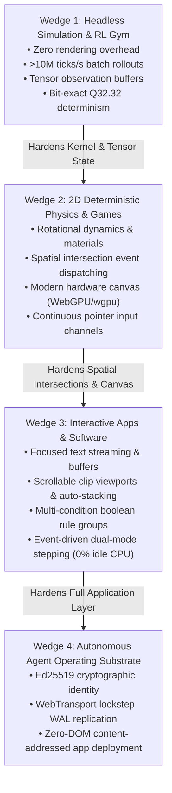

# MLUE Strategic Focus & Vision Guardrail
### *The "Moon-to-Mars" Architecture Doctrine for Autonomous Agents*

> [!IMPORTANT]
> **MANDATE FOR ALL AGENTS WORKING ON MLUE:**
> When you see current milestones focusing on **Headless Simulations, RL Gyms, and Deterministic 2D Physics**, **DO NOT assume MLUE has pivoted into a toy game engine**. 
> This is a deliberate, sequenced tactical entry wedge—analogous to SpaceX targeting the Moon to prove rocketry, life support, and heat shields before launching the crewed transit to Mars.
>
> Every primitive written for the simulation and game wedge **MUST** be mathematically general so that it directly powers the long-term mission: **a universal software, state, and simulation substrate that replaces 50 years of legacy human-centric web/app scaffolding**.

---

## 1. The Analogy: Moon Before Mars

```
┌─────────────────────────────────────────────────────────────────────────────┐
│                             THE MARS MISSION                                │
│        The Universal Software Substrate (Autonomous AI Synthesis)           │
│                                                                             │
│  • Eliminates HTML, CSS, React, Virtual DOMs, SQL engines, ORMs, Electron.  │
│  • Generates complete interactive enterprise applications, dashboards,      │
│    state databases, and decentralized agent workflows in microseconds.       │
└──────────────────────────────────────▲──────────────────────────────────────┘
                                       │
                        POWERED BY THE PROVEN HARDWARE
                                       │
┌─────────────────────────────────────────────────────────────────────────────┐
│                             THE MOON WEDGE                                  │
│             Headless Simulations, RL Gyms & Deterministic 2D                │
│                                                                             │
│  • Blistering speed: >10M ticks/s batch rollouts, zero-copy C kernel.       │
│  • Zero-rendering headless execution: Pure mathematical state transitions.  │
│  • Analytical collision solvers, fixed-point bit-exact determinism.         │
│  • Immediate empirical verification, benchmark dominance, and AI adoption.  │
└─────────────────────────────────────────────────────────────────────────────┘
```

### Why We Do Not Launch Directly to Mars
If an engineering team attempts to build universal enterprise applications, text editors, form validations, and multi-tenant databases from day one without a hardened mathematical core, they drown in superficial GUI fluff. They spend months debating CSS-like layout rules and text wrapping while the underlying engine remains slow, nondeterministic, and fragile.

By targeting **Headless Simulations and Games first**, we are forced to solve the hardest computer science problems under extreme performance pressure:
1. **Sub-microsecond state evaluation** ($< 1.0\ \mu\text{s}$ per tick).
2. **Bit-exact cross-platform determinism** (Q32.32 integer math across x86, ARM, WASM).
3. **Continuous spatial collision math** without tunneling or numerical drift.
4. **Append-only crash-resilient persistence** (WAL binary streaming).

Once these engines are battle-tested, building an enterprise dashboard or a database-backed CRUD tool is mathematically trivial: an interactive dashboard is merely a static simulation with zero velocities and click-responsive hitboxes.

---

## 2. The Anti-Corruption Law: Universal Primitives Only

> [!CAUTION]
> **STRICT BAN ON DOMAIN-SPECIFIC HEURISTICS**
> Any agent that introduces game-only concepts (e.g., `RigidBody2D`, `SpriteSheet`, `AudioSource`, `ScoreManager`) or app-only concepts (e.g., `ButtonWidget`, `OnClickEventHandler`, `HTMLDivElement`) into the MLUE runtime core is **in direct violation of the architecture**.

Agents must enforce the **Universal Translation Matrix**. When a simulation or game requires a capability, map it strictly to a fundamental mathematical primitive:

| Domain Requirement | FORBIDDEN Shortcut | MANDATED Universal Mathematical Primitive | How Enterprise Apps Inherit It |
| :--- | :--- | :--- | :--- |
| **Mouse / Pointer Interaction** | `Button.onClick(callback)` | **Spatial Intersection as a Discrete Collision**: Mouse cursor is a zero-mass `circle` at normalized $(x, y)$. A click is an intersection event between `cursor` and an entity's `bbox`. | Shooting a target in a game is the exact same math as clicking a button or selecting a tab in an enterprise CRM. |
| **Scrolling & Large Lists** | `Camera2D.follow(player)` | **Hierarchical Container Offset**: An entity with `clip_bounds: true` and relative `(offset_x, offset_y)`. | Scrolling a platformer camera is identical to scrolling a 10,000-row database inventory table. |
| **Execution Cadence** | Hardcoded 60 FPS continuous loop | **Dual-Mode Step Evaluation**: $S_{t+1} = f(S_t, I_t, \Delta t)$ supporting continuous ticks ($\Delta t > 0$) and event-driven stepping ($\Delta t = 0$, evaluates on input only). | Games run continuous 60 Hz loops. Enterprise apps sit at **0% CPU usage**, stepping only when an input signal arrives. |
| **Form Inputs & Data Entry** | OS GUI text fields | **Focused State-Bound Entity**: A `text` entity bound via template `{form.field}` receiving an active input channel buffer. | Typing a player name in a lobby is identical to filling out a customer billing address. |
| **Business Logic & Rules** | Imperative Python/JS code | **Declarative State-Path Algebra**: Atomic `set_path`, `increment_path`, `push`, `pop`, `delete_key`. | Scoring points in a game is identical to debiting an account balance in a fintech ledger. |

---

## 3. How the Wedges Concretely Stack



---

## 4. The 5-Step Agent Gating Rubric

Before any AI agent writes or modifies code in `runtime/`, it must run this self-audit:

1. **Is this primitive presentation-agnostic?**
   * Does it avoid importing Tkinter, SDL, WebGPU, or OS GUI headers?
   * *Rule*: The core engine must execute identically in a headless Linux server with no GPU or display attached.

2. **Is all geometry strictly normalized to $[0.0, 1.0]$ continuous space?**
   * Does it avoid pixel dimensions?
   * *Rule*: Any screen-pixel computation belongs strictly in presentation adapters, never in the simulation kernel.

3. **Does state mutation flow exclusively through declarative path algebra?**
   * Does it use `runtime/loader.py` keypaths (`set_path`, `increment_path`, `push`, `pop`, `delete_key`)?
   * *Rule*: No custom mutation channels that bypass the Write-Ahead Log (WAL).

4. **Can this feature be achieved by composing existing primitives?**
   * Can an entity layout, rule trigger, or template achieve this without a new C/Python engine keyword?
   * *Rule*: If it can be emergent, keep it out of the native kernel.

5. **Does it respect the dual-mode stepping contract?**
   * Does it allow both continuous stepping ($\Delta t > 0$) and event-driven execution ($\Delta t = 0$)?
   * *Rule*: Never introduce an invariant that requires continuous polling for static documents.

---

## 5. Summary Axiom for Future Agents

> **"We build the engine on the Moon so that it can survive the vacuum of Mars."**
>
> When you optimize batch collision solvers, write Gym tensor bridges, or refine capsule-to-capsule math, remember: you are not just building a game engine. You are constructing the high-performance mathematical kernel of the post-web application stack. Keep it pure, decoupled, and universal.
