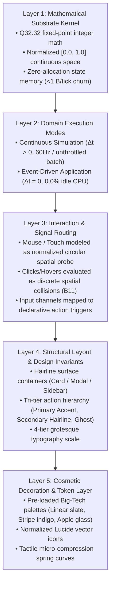

# THE BRAND NEW MLUE: The Universal Software Manufacturing Substrate & AI-Native Genome

> **Status:** Master Architectural Specification & Strategic Core Moat  
> **Target Audience:** Autonomous Agents, Core Engineers, and System Architects  
> **Milestone Status:** Wedge 1 (Headless Kernel & RL Gym — Completed) | Wedge 2 (2D Physics & Presentation — Active)  
> **Foundational Thesis:** *“AI is the builder. Humans are users. Strip away 50 years of human cognitive scaffolding and distill software down to its evolutionary winners.”*

---

## 1. Executive Summary: What MLUE Actually Is

MLUE is not an incremental web framework, not a prompt wrapper, and not a toy game engine.

**MLUE is a complete, zero-dependency Software Manufacturing Substrate engineered from first principles for machine intelligence.**

```
┌─────────────────────────────────────────────────────────────────────────────┐
│                           THE MLUE FORMULA                                  │
│                                                                             │
│   50 Years of Big-Tech Natural Selection                                   │
│            │                                                                │
│            ▼ (Ruthless Distillation)                                        │
│   The Evolutionary Winners Library (The Standardized Parts)                │
│            │                                                                │
│            ▼ (Assembled via)                                                │
│   The Phased Ground-Up Blueprint (Movement First, Casing Second)           │
│            │                                                                │
│            ▼ (Executed on)                                                  │
│   The Deterministic Silicon Engine (<1.0 µs, Q32.32, Zero-Allocation)     │
│            │                                                                │
│            ▼ (Accessed via)                                                 │
│   The Unified Semantic Gateway (MCP / Local SDK / Binary Container)         │
│            │                                                                │
│            ▼                                                                │
│   Superhuman Software Synthesis for ANY AI Model (Claude, GPT, Gemini, Llama│
└─────────────────────────────────────────────────────────────────────────────┘
```

### The Definition of the Core Moat

* **The Interface (MCP, Python SDK, CLI) is just the doorway.** Anyone can build an API or an MCP server in an afternoon. A doorway has zero proprietary value without what sits behind it.
* **The CORE MOAT is the entire precision factory behind the door:**
  1. **The Building Materials:** The curated catalog of software's evolutionary winners (geometry, hairlines, slate palettes, normalized vector icons).
  2. **The Assembly Blueprint:** The phased ground-up build sequence that prevents AI hallucination.
  3. **The Precision Machinery:** The zero-dependency deterministic execution kernel ($<1.0\ \mu\text{s}$ per tick, bit-exact Q32.32 math, zero heap churn).
  4. **The Quality Control Gauge:** Automated telemetry verification across 13 Ruthless Benchmarks and the Progressive Test-As-You-Build Protocol.

---

## 2. Scope & Strategic Boundaries: What MLUE Is & Is NOT

MLUE maintains strict, uncompromising boundaries to prevent mission drift and architectural bloat:

```
┌─────────────────────────────────────────────────────────────────────────────┐
│                           STRICT NEGATIVE SCOPE                             │
│                      (What We Will NEVER Build)                             │
├─────────────────────────────────────────────────────────────────────────────┤
│ ❌ NO 3D AAA Games (No GTA, Call of Duty, Unreal 5 competitors).            │
│ ❌ NO Complex 3D Mesh Pipelines (No Blender import trees, skeletal rigs).   │
│ ❌ NO Heavy Shader Graphs / Photorealistic Raytracing pipelines.            │
│ ❌ NO 1995 Legacy Web Scaffolding (No HTML, CSS, React, Virtual DOMs).       │
└─────────────────────────────────────────────────────────────────────────────┘
                                      │
                                      ▼
┌─────────────────────────────────────────────────────────────────────────────┐
│                           STRICT POSITIVE SCOPE                             │
│                      (The 3 Pillars of MLUE)                                │
├─────────────────────────────────────────────────────────────────────────────┤
│ 1. SCIENTIFIC & SYSTEM SIMULATIONS                                          │
│    • Continuous kinematics, orbital mechanics, hydraulic networks, swarms.  │
│ 2. DETERMINISTIC 2D GAMES & REINFORCEMENT LEARNING GYMS                     │
│    • Breakout, Pong, grid games, multi-agent reinforcement learning arenas. │
│ 3. INTERACTIVE SOFTWARE APPLICATIONS                                        │
│    • Dashboards, control panels, monitoring interfaces, CRMs, data tools.   │
└─────────────────────────────────────────────────────────────────────────────┘
```

---

## 3. The Curated Genome of Software: The Evolutionary Winners

Over the last 50 years, the software industry acted as a massive natural selection arena. Millions of experimental patterns (table layouts, Flash, bevel borders, skeuomorphic textures, unstyled 1995 browser defaults) lost the battle and went extinct.

A tiny set of conventions **won the battle decisively** because they match human optical biology, cognitive psychology, and silicon hardware physics. MLUE standardizes these winners as its zero-configuration baseline:

```
┌─────────────────────────────────────────────────────────────────────────────┐
│                     THE SURVIVING GENOME TAXONOMY                           │
├──────────────────────────┬──────────────────────────┬───────────────────────┤
│ Architectural Dimension  │ What Lost the Battle     │ What Won the Battle   │
│                          │ (Extinct in MLUE)        │ (Standardized in MLUE)│
├──────────────────────────┼──────────────────────────┼───────────────────────┤
│ Geometry & Corners       │ Sharp 90° rectangles,    │ Soft Squircles (Cards)│
│                          │ 3D bevel borders         │ Full Capsules (Actions│
├──────────────────────────┼──────────────────────────┼───────────────────────┤
│ Borders & Edges          │ Thick 2px+ black borders,│ 1px Optical Hairlines │
│                          │ inset/grooved lines      │ (Translucent Light)   │
├──────────────────────────┼──────────────────────────┼───────────────────────┤
│ Surfaces & Elevation     │ Heavy drop shadows,      │ Luminance Stacking    │
│                          │ skeuomorphic wood/leather│ (#020617 → #0F172A)   │
├──────────────────────────┼──────────────────────────┼───────────────────────┤
│ Typography Scales        │ 10,000 arbitrary fonts,  │ 4-Scale Grotesque     │
│                          │ serif body, pixel sizes  │ (Display, Title, Body,│
│                          │                          │ Microcode Monospace)  │
├──────────────────────────┼──────────────────────────┼───────────────────────┤
│ Motion & Animation       │ Linear ease-in-out,      │ Physical Springs      │
│                          │ 1-second loading spinners│ (Damped Harmonic)     │
├──────────────────────────┼──────────────────────────┼───────────────────────┤
│ Vector Glyphs & Icons    │ Raw SVG imports,         │ AOT Normalized Vector │
│                          │ DOM icon packages        │ Coordinate Paths      │
└──────────────────────────┴──────────────────────────┴───────────────────────┘
```

### The AOT Vector Ingestion Pipeline
Instead of manually drawing 1,500 icons or importing bloated NPM packages:
* Open-source icon sets (Lucide, Heroicons, Phosphor) are ingested ahead-of-time (AOT) via a compiler script.
* They are converted into lightweight, zero-dependency, normalized $[0.0, 1.0]$ vector entities in `registry/icons/*.mlue`.
* Each icon is semantically indexed with metadata tags (`tags: ["search", "magnifier", "find"]`), allowing AI models to retrieve the exact vector geometry instantly via semantic search.

---

## 4. The Phased Ground-Up Manufacturing Protocol

A core law of the brand new MLUE is: **Movement First, Casing Second.**

You never design cosmetic decorations (Layer 5) before establishing the mathematical state transitions (Layer 1). Every application synthesized by an AI model follows this strict 5-layer dependency sequence:



---

## 5. The Zero-Redundancy Silicon Engine

MLUE completely eliminates the front-layer redundancy that plagues legacy web frameworks:

### The Silicon Law: Recomputing vs. Remembering
* **ALU Math is virtually free:** Recomputing lightweight kinematic coordinates ($x + v \cdot \Delta t$) in hardware registers takes **~0.3 nanoseconds** (1 clock cycle).
* **Memory & DOM lookups are expensive:** Looking up a cache table or traversing a DOM layout tree takes **10 to 500,000 nanoseconds**.
* **Pixel rasterization must be memoized:** Pushing millions of pixels to a display panel requires GPU-level texture caching.

### How MLUE Implements Zero Redundancy
1. **The Dual-Mode Stepping Contract ($\Delta t > 0$ vs. $\Delta t = 0$):**
   * Simulations and games step continuously ($\Delta t > 0$).
   * Interactive software applications and dashboards sit at **0.0% idle CPU** ($\Delta t = 0$). The engine evaluates layout **once** at initialization and sleeps until an external input signal arrives.
2. **Spatial Pointer Collisions (No DOM Event Bubbling):**
   * The cursor is a zero-mass probe at normalized $(x, y)$.
   * Hovering or clicking a button is calculated as a spatial intersection against the Dynamic Spatial Hash Grid (Benchmark B11).
   * If the mouse does not move, **zero intersection calculations occur**.
3. **Hardware Canvas & Buffer Separation (Wedge 2):**
   * Static geometry (buttons, panel borders, cards) is uploaded to GPU Static Vertex Buffers (VBOs) **once**.
   * Only dynamic transforms stream to the GPU via uniform buffers. The CPU never re-measures or re-layouts static UI.
4. **Cryptographic State Deduplication (Benchmark B9 & B12):**
   * Fixed-point Q32.32 math guarantees 100% bit-exact parity across x86, ARM, and WASM.
   * If the state digest does not change ($\text{Digest}_t == \text{Digest}_{t-1}$), the presentation adapter skips frame generation entirely.

---

## 6. Internal Architecture & File Organization

To prevent architectural entropy, MLUE maintains strict separation between the universal mathematical kernel, domain modes, and the asset registry:

```
mlue/
├── runtime/                        ◄── LAYER 1: PURE MATHEMATICAL SUBSTRATE
│   ├── engine.py / native_core.c   │   (Zero UI, zero icons, pure state math)
│   ├── spatial.py                  │   (Dynamic spatial hash grid BVH, collisions)
│   ├── fixed_point.py              │   (Deterministic Q32.32 integer math)
│   ├── binary.py                   │   (Zero-copy binary .mlueb container)
│   ├── wal.py                      │   (Write-ahead logging & deterministic replay)
│   └── model.py                    │   (Universal entity, rule, and state dataclasses)
│
├── modes/                          ◄── LAYER 2: DOMAIN EXECUTION RUNNERS
│   ├── simulation/                 │   (Continuous kinematics, physical conservation)
│   ├── games/                      │   (Score tracking, tick loops, live input polling)
│   └── applications/               │   (Event-driven stepping Δt=0, focused text buffers)
│
├── registry/                       ◄── LAYERS 4 & 5: THE SURVIVING DESIGN GENOME
│   ├── tokens/                     │   (The proven rules, metrics & colors)
│   │   ├── geometry.json           │   (Squircle radii, capsule ratios, hairline widths)
│   │   ├── typography.json         │   (Display, Title, Body, Microscale standards)
│   │   └── palettes.json           │   (Curated Big-Tech slates, accents, gradients)
│   ├── icons/                      │   (AOT-ingested normalized Lucide vectors)
│   │   ├── search.mlue             │   (Tagged for AI semantic retrieval)
│   │   ├── chevron.mlue
│   │   └── activity.mlue
│   └── templates/                  │   (The 5 battle-tested compound primitives)
│       ├── button.mlue             │   (Primary, Secondary, Ghost compound templates)
│       ├── card.mlue               │   (Hairline surface container)
│       ├── metric_cell.mlue        │   (Horizontal data row with status pill)
│       └── input_field.mlue        │   (Focused state-bound text entry)
│
├── adapters/                       ◄── HARDWARE PRESENTATION PIPELINE
│   ├── webgpu/                     │   (Hardware-accelerated screen client)
│   ├── desktop_canvas/             │   (Native windowing presentation)
│   └── headless/                   │   (Ultra-high-throughput RL rollout runner)
│
└── mcp/                            ◄── UNIFIED AI AGENT GATEWAY
    └── server.py                   │   (Under 10 core tools + queryable resource catalog)
```

**The Absolute Gating Invariant:** `runtime/` must NEVER import anything from `registry/` or `adapters/`. The core kernel remains decoupled and presentation-agnostic under all circumstances (Benchmark B1).

---

## 7. The AI Experience via MCP: Small Verbs, Infinite Nouns

To prevent context-window exhaustion and LLM tool confusion:
* **We do NOT expose 1,500 individual tools.**
* **We expose under 10 high-level operational tools (Verbs):**
  1. `mlue_inspect_state`: Reads the complete mathematical state tree.
  2. `mlue_step_simulation`: Advances continuous simulation time ($\Delta t > 0$).
  3. `mlue_dispatch_input`: Injects a discrete event into an input channel ($\Delta t = 0$).
  4. `mlue_mutate_state`: Applies declarative path algebra (`set_path`, `increment_path`).
  5. `mlue_search_registry`: Semantically searches icons, templates, and palettes.
  6. `mlue_verify_invariants`: Runs static reachability and determinism audits.
* **The Entire Genome is exposed as queryable MCP Resources (Nouns):**
  * `mlue://registry/tokens/palettes`
  * `mlue://registry/templates/card`
  * `mlue://registry/icons/{id}`

An AI model queries only the specific tokens it needs, keeping its active context overhead under **2,000 tokens** while retaining instant access to an infinite design library.

---

## 8. Why ANY Model Becomes Superhuman Inside MLUE

Because the **Core Moat** is the factory—the standardized parts, the phased assembly line, and the deterministic substrate:

1. **Model Independence:** A 7-billion parameter open-source local model operating inside MLUE will produce software that is faster, more robust, and more visually stunning than a frontier model trying to write raw React and Tailwind on the open web.
2. **Zero Hallucination Surface:** Because the parts only snap together in mathematically valid ways (normalized coordinates, declarative state paths, pre-tuned typography scales), the model cannot accidentally create broken layouts or overlapping text.
3. **Sub-Second Synthesis:** The AI generates a 50-line declarative MLUE manifest rather than 5,000 lines of fragile JavaScript, CSS, and SQL.

---

## 9. The Progressive Verification & Human Intervention Protocol

A core reason autonomous AI coding agents produce fragile software is the **Blind-Build Fallacy**: writing hundreds of lines of speculative code and deferring testing to the very end, or hallucinating "success" on subjective criteria an AI cannot physically evaluate.

To guarantee zero-defect manufacturing, MLUE enforces a strict **3-Tier Verification Standard**:

```
┌─────────────────────────────────────────────────────────────────────────────┐
│                    THE 3-TIER VERIFICATION GAUGE                            │
├──────────────────────────┬──────────────────────────────────────────────────┤
│ Tier 1: Progressive Unit │ Test-As-You-Build in lockstep with feature code  │
│         Testing (TDD)    │ (Run continuously: 132 → 144 → 153 unit tests)   │
├──────────────────────────┼──────────────────────────────────────────────────┤
│ Tier 2: Automated Silicon│ 13 Non-Overlapping Empirical Benchmarks (B1–B13) │
│         Telemetry Gate   │ (0.0 PPB drift, <1 B/step churn, >10k ticks/s)   │
├──────────────────────────┼──────────────────────────────────────────────────┤
│ Tier 3: Human-in-the-Loop│ Escalate ONLY when automation is impossible:     │
│         Intervention     │ 1. Sensory/biological (thumb reach, optics)      │
│                          │ 2. Irreversible boundaries (real payments, auth) │
└──────────────────────────┴──────────────────────────────────────────────────┘
```

### Pillar A: Progressive Test-As-You-Build (Zero Blind Code)
* **Never Batch Testing at the End:** Features are decomposed into discrete, testable sub-phases. Every sub-phase MUST introduce unit tests covering edge cases, math invariants, and state transitions **before** the sub-phase is marked complete.
* **Regression Invariance:** Every unit test ever written is part of the persistent test suite (`tests/test_*.py`). The entire suite must execute with 100% green passes before any commit is finalized.
* **Continuous Progressive Growth:** The test count expands continuously in lockstep with the codebase (e.g., Wedge 1 completed with 132 tests; Wedge 2 Phase 1 reached 144 tests; Phase 2 reached 153 tests).

### Pillar B: Automated Silicon Telemetry Gate (B1 – B13)
* Individual unit tests verify feature behavior; the **13 Telemetry Benchmarks** verify hardware and mathematical laws.
* Every release must empirically prove:
  * **B1:** Tier L1 Substrate Decoupling (0 foreign OS/GUI imports in core runtime).
  * **B4:** Zero-drift physical conservation ($\le 1000$ PPB, observed $0.0$ PPB).
  * **B6:** High execution throughput ($> 10,000$ ticks/s, observed $> 20,000$ ticks/s).
  * **B7:** Minimal memory churn ($< 1$ Byte/step, observed $0.59$ B/step).
  * **B8:** Bounded cyclomatic complexity ($\le 30$ NIST limit, observed $27$).
  * **B13:** Autonomous RL Gym & LiDAR perception ($> 2,000$ steps/s, observed $> 5,000$ steps/s).

### Pillar C: The Human Intervention Protocol (The Exhaustion Principle)

Human attention is the most expensive and scarce resource in software manufacturing. Autonomous agents must treat human intervention not as an everyday crutch, but as a **strictly gated final safety valve**.

#### 1. The Exhaustion Mandate: Automate First, Escalate Last
An agent is **strictly forbidden from requesting human intervention** if an automated verification path exists:
* **Payments & Billing:** Never ask a human to test checkout if Stripe test cards (`tok_visa`), webhook mockers, or sandbox keys can simulate the flow.
* **Authentication & Permissions:** Never ask a human to log in if mock JWTs, synthetic bearer tokens, or local auth providers can verify the session.
* **Database & Destruction:** Never ask a human to test schema drops if ephemeral SQLite or in-memory containers can verify the migration.

#### 2. The Only Two Legitimate Escalation Triggers
Human intervention is triggered **only** when crossing one of two impassable boundaries:

* **Trigger 1: Biological & Sensory Perception (No AI Sensory Hardware)**
  * An AI cannot physically hold a smartphone to evaluate thumb-reach ergonomics on physical glass.
  * An AI cannot look at a screen in direct sunlight to judge optical glare, readability, or eye fatigue.
  * An AI cannot feel whether a tactile spring animation feels "weighty" or "sluggish" to human motor reflexes.
* **Trigger 2: Irreversible Real-World & Security Boundaries**
  * Crossing into live production financial transactions (charging a real credit card with real money).
  * High-privilege production infrastructure operations (dropping a live database, issuing non-reversible DNS or SSL changes).
  * Entering physical credentials, 2FA hardware keys, or confidential production API tokens that an AI must never handle autonomously.

#### 3. The 3-Step Human Escalation Protocol
When an agent hits a legitimate escalation trigger, it must follow this structured protocol:
1. **Halt & Contextualize:** Stop execution immediately. Do not attempt to guess or hallucinate success.
2. **Present Clear Verification Artifacts:** Present the human operator with:
   * What was *already verified* automatically via Tier 1 & Tier 2 tests.
   * The *exact, isolated question or action* requiring human intervention.
   * Clear interactive choices or visual previews (no ambiguous open-ended prompts).
3. **Deterministic Codification:** Once the human provides sign-off or completes the action, the agent immediately codifies that decision into deterministic tokens, mock fixtures, or unit tests so the human never has to intervene on that exact item again.

---

## 10. Conclusion & Execution Mandate

> **"We do not build a separate engine for games and a separate engine for software. An interactive button is merely a stationary obstacle, a click is merely a zero-mass collision, and an application layout is merely a static physical equilibrium."**

The path forward is clear:
1. Complete **Wedge 2** by hardening pointer collisions, dual-mode stepping ($\Delta t = 0$), constraints/springs, and hardware canvas rendering.
2. Advance to **Wedge 3** by formalizing the AOT Lucide icon ingestion and the curated design token registry.
3. Advance to **Wedge 4** to empower autonomous AI agents to synthesize complete enterprise applications, simulations, and games at superhuman speed.
